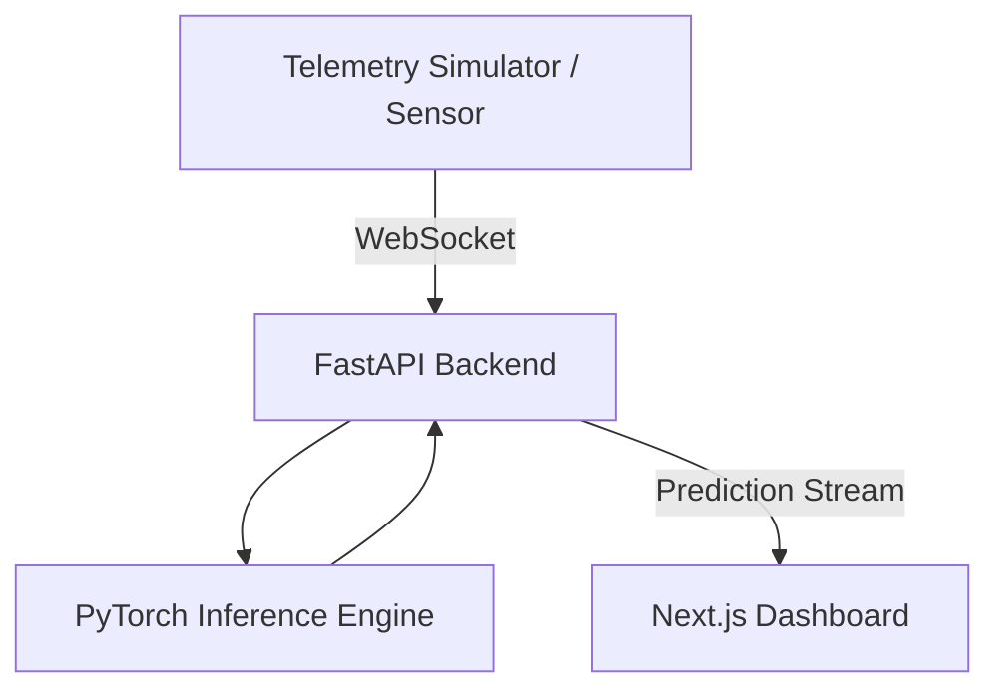

# ChronosMamba

**Real-time AI-powered telemetry monitoring platform built with FastAPI, PyTorch, Next.js, and WebSockets.**

---

## Overview

ChronosMamba is a full-stack telemetry analytics platform that streams sensor data in real time, performs sequence-based inference using a Mamba-inspired neural network, and visualizes predictions, anomaly scores, and model metrics through an interactive dashboard.

The project demonstrates modern AI system design by combining:

* FastAPI backend
* PyTorch inference engine
* Next.js 15 frontend
* WebSocket-based real-time communication
* Interactive telemetry visualization using Apache ECharts

---

## Architecture



---

## Features

* Real-time telemetry streaming
* Live prediction visualization
* AI-based anomaly scoring
* Interactive dashboard
* Adjustable anomaly threshold
* Live WebSocket communication
* Docker support
* Modular FastAPI backend
* Responsive Next.js frontend

---

## Tech Stack

### Backend

* FastAPI
* PyTorch
* Pydantic
* Uvicorn
* Async WebSockets

### Frontend

* Next.js 15
* React
* TypeScript
* Tailwind CSS
* Apache ECharts
* Lucide React

---

## Running the Project

### Docker

```bash
docker compose up --build
```

---

### Manual Setup

#### Backend

```bash
cd backend

pip install -r requirements.txt

python run.py
```

---

#### Telemetry Simulator

```bash
cd backend

python telemetry_simulator.py
```

---

#### Frontend

```bash
cd frontend

npm install

npm run dev
```

Open:

```
http://localhost:3000
```

---

## REST API

### Health Check

```
GET /health
```

Response

```json
{
  "status": "ok"
}
```

---

## WebSocket API

Endpoint

```
ws://localhost:8000/ws/telemetry
```

Incoming packet

```json
{
  "timestamp": "2026-06-25T12:00:00Z",
  "sensor_id": "sensor_01",
  "metrics": [0.1, 0.2, 0.3]
}
```

Outgoing packet

```json
{
  "timestamp": "2026-06-25T12:00:00.100Z",
  "prediction": [0.22, 0.35],
  "anomaly_score": 0.031,
  "mse": 0.002,
  "latent_variance": 0.91,
  "window_size": 256
}
```

---

## Model

The backend includes a PyTorch-based sequence model inspired by the Mamba (Selective State Space Model) architecture. The implementation is designed for streaming inference and real-time telemetry prediction while remaining lightweight enough for demonstration and experimentation.

---

## Performance Configuration

| Parameter        | Value |
| ---------------- | ----- |
| Sequence Length  | 256   |
| Hidden Dimension | 128   |
| Batch Size       | 1     |

---

## Project Structure

```
ChronosMamba
│
├── backend/
│   ├── app/
│   │   ├── main.py
│   │   ├── model.py
│   │   ├── schemas.py
│   │   ├── stream_manager.py
│   │   └── config.py
│   ├── requirements.txt
│   ├── Dockerfile
│   ├── telemetry_simulator.py
│   └── run.py
│
├── frontend/
│   ├── src/
│   │   ├── app/
│   │   ├── components/
│   │   ├── context/
│   │   └── hooks/
│   ├── package.json
│   ├── Dockerfile
│   └── tsconfig.json
│
├── docker-compose.yml
├── .gitignore
└── README.md
```

---

## Future Improvements

* Authentication and user management
* Historical telemetry database
* Model checkpoint loading
* Multi-sensor dashboards
* Alert notifications
* Deployment pipeline
* CI/CD automation
* Cloud deployment
